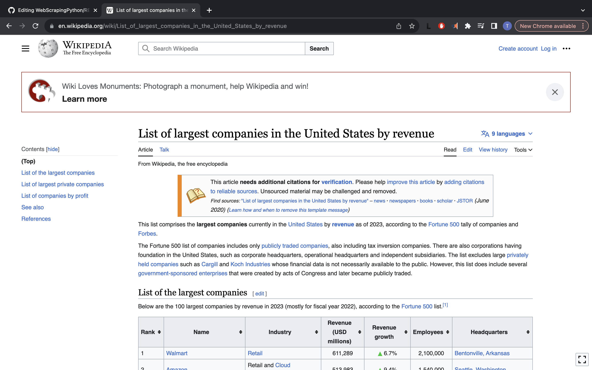
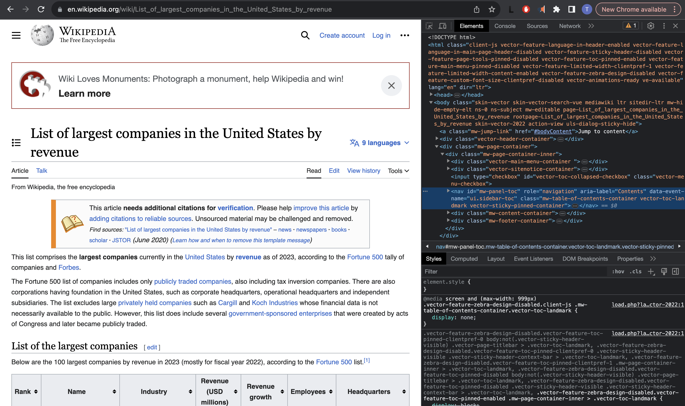
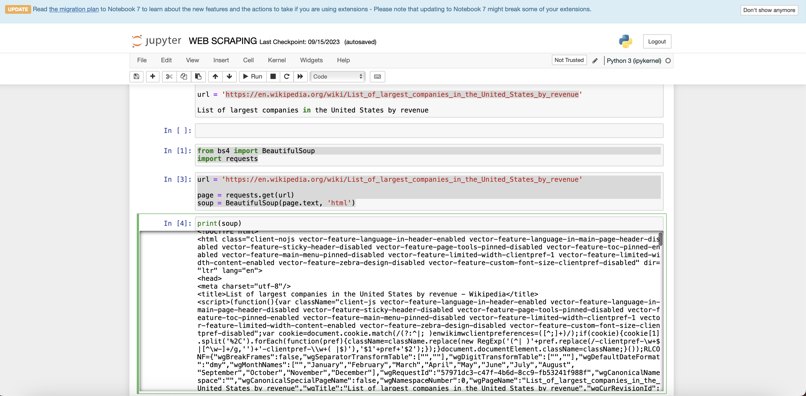
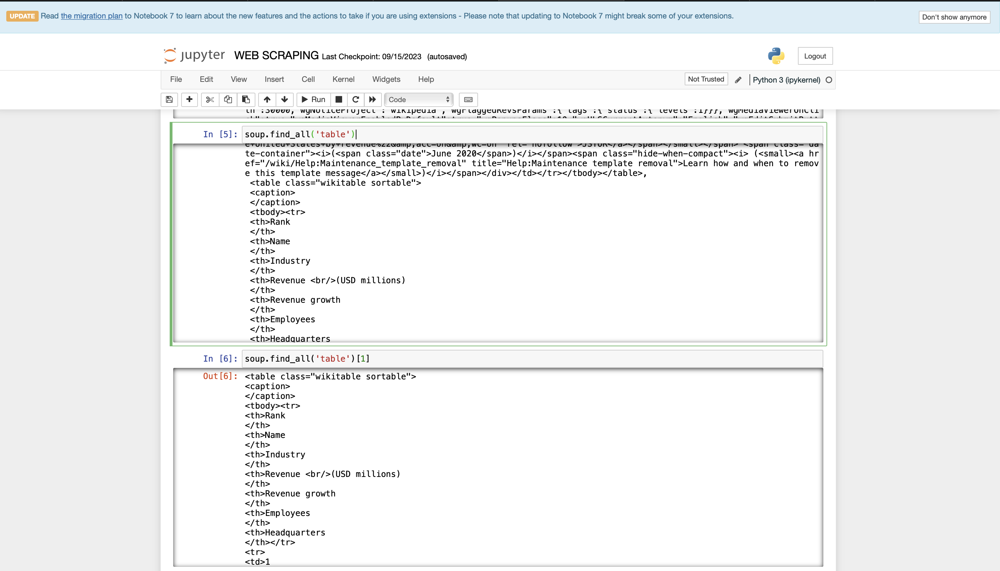
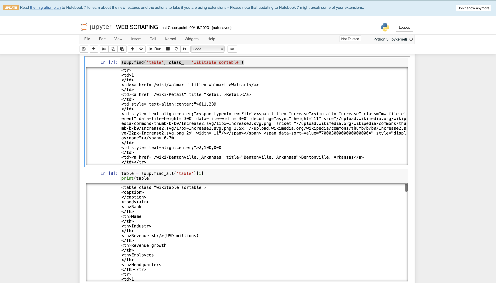
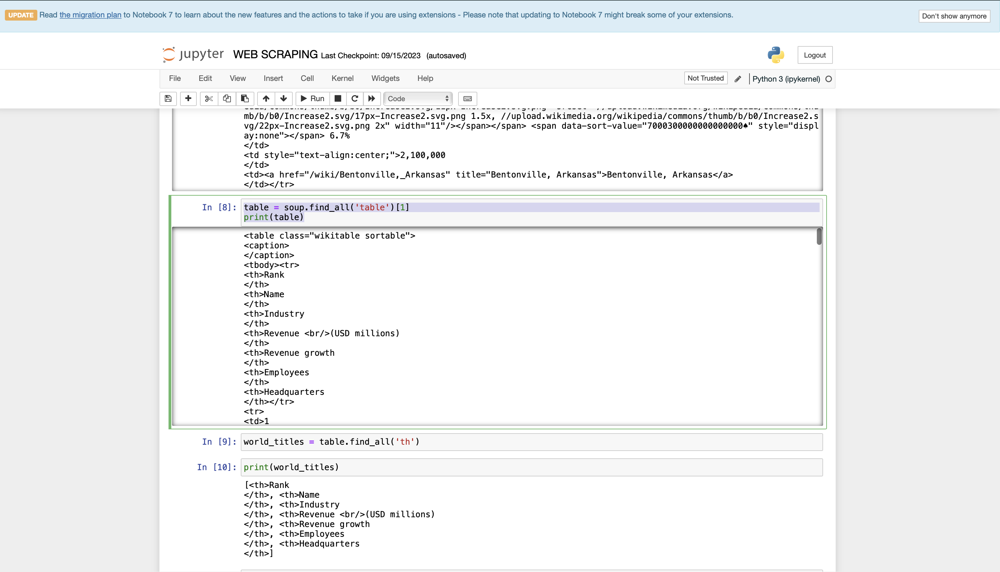

# Web Scraping with Python

## List of largest companies in the United States by revenue in 2023
Data Source: Wiki
Url: https://en.wikipedia.org/wiki/List_of_largest_companies_in_the_United_States_by_revenue

## Problem Statement
The objective of this portfolio project is to perform web scraping using Python to extract and document the list of the largest companies in the United States by revenue for the year 2023. This project aims to demonstrate proficiency in web scraping techniques, data extraction, and data handling, ultimately resulting in a well-structured and organized dataset that showcases the top companies and their respective revenues, contributing to a comprehensive understanding of the economic landscape in the United States in 2023.

## Solution

- The first thing I did was to inspect the webpage as shown below

- Next I Import the python libraries (Beautiful Soup) needed as shown
  
        from bs4 import BeautifulSoup
        import requests

- I sent an HTTP request, so I can get the webpage I want to scrap

        url = 'https://en.wikipedia.org/wiki/List_of_largest_companies_in_the_United_States_by_revenue'
        
        page = requests.get(url)
        soup = BeautifulSoup(page.text, ‘html')

  

- Next I go through the Soup, then I extracted all the tables in it.

        soup.find_all(‘table')

- After seeing all the tables, I located the table I need and to get it

        soup.find_all(‘table’)[1] 

  

- The next thing I did was give the table a name so I can reference it. I call it **table**.

        table = soup.find_all('table')[1]
        print(table)

- Now I want to get the columns sorted out. I see the columns are tagged ‘th’. So I call the columns world_titles

        world_titles = table.find_all(‘th')
        print(world_titles)

- 
